# 🌿 PackAI India — SIH26236 Production Engine
### AI-Based Intelligent Food Packaging Material Recommendation System for Food Commodities
**Ministry of Food Processing Industries (MoFPI) | Smart India Hackathon (SIH) Problem Statement: SIH26236**  
*Target Initiative: Pradhan Mantri Formalisation of Micro food processing Enterprises (PMFME) & One District One Product (ODOP)*

[](https://python.org)
[](https://fastapi.tiangolo.com)
[](https://react.dev)
[](https://vitejs.dev)
[](https://scikit-learn.org)
[](https://fssai.gov.in)
[](#)

---

## 📌 Executive Overview

In India's agro-food processing sector, micro-enterprises, Farmer Producer Organizations (FPOs), and Self-Help Groups (SHGs) under the **PMFME Scheme** face severe post-harvest losses and regulatory penalties due to:
1. **Unscientific Packaging Selection:** Relying on generic, non-barrier low-density poly bags (LDPE) leading to premature rancidity, moisture sogginess, and micro-perforation failures.
2. **Regulatory Non-Compliance:** Ignorance of mandatory statutory standards under the **Food Safety and Standards Authority of India (FSSAI)**, **Bureau of Indian Standards (BIS)**, and **Central Pollution Control Board (CPCB) Extended Producer Responsibility (EPR)**.
3. **Lack of Affordable Technical Tools:** Commercial packaging testing labs charge substantial consulting fees inaccessible to rural micro-processors.

**PackAI India** solves this bottleneck with an **offline-first, biophysically deterministic, AI-guided packaging recommendation engine and statutory compliance studio**. It converts physical food characteristics ($\text{moisture } M_0$, $\text{fat/oil } F$, $\text{pH}$, target shelf-life $\theta$, and ambient climate $T$, $\text{RH}$) into optimal multi-layer barrier laminates, industrial converter economics, CPCB EPR obligations, reverse FSSAI artwork audits, cryptographic digital product passports, and 1-page statutory packaging readiness certificates.

---

## 🏛️ Interactive System Architecture

```mermaid
graph TD
    %% Custom Styling Palette
    classDef client fill:#f0fdf4,stroke:#16a34a,stroke-width:2px,color:#166534,font-weight:bold;
    classDef frontend fill:#ecfeff,stroke:#0891b2,stroke-width:2px,color:#155e75;
    classDef api fill:#f8fafc,stroke:#475569,stroke-width:2px,color:#1e293b;
    classDef engine fill:#eef2ff,stroke:#4f46e5,stroke-width:2px,color:#3730a3;
    classDef legal fill:#fffbeb,stroke:#d97706,stroke-width:2px,color:#92400e;
    classDef output fill:#fdf2f8,stroke:#db2777,stroke-width:2px,color:#9d174d,font-weight:bold;

    %% 1. Client & Multimodal Input Tier
    subgraph ClientTier ["1. User & Multimodal Input Tier"]
        User["PMFME Food Processor / FPO Enterprise"]:::client
        VoiceInput["Web Speech Recognition (Bilingual hi-IN & en-IN)"]:::client
        CropSelector["18 Seeded ODOP Crops OR Custom Crop Studio"]:::client
        ParamSliders["Environmental Controls (Temp: 4-45°C, RH: 20-95%)"]:::client
        ThemeSwitch["Dark / Light Mode & Bilingual Accessibility Switcher"]:::client
    end

    %% 2. Frontend Application Layer
    subgraph FrontendTier ["2. Client-Side Dashboard (React 18 + Vite + Tailwind)"]
        SPA["React Coordinator & ErrorBoundary (App.jsx)"]:::frontend
        LaminateViz["2.5D Multi-Layer Laminate Stack Visualizer"]:::frontend
        DecaySim["Biophysical Shelf-Life SVG Simulator (Arrhenius Q10)"]:::frontend
        LabelAuditorView["Reverse FSSAI Label Artwork Audit Studio (/audit)"]:::frontend
        PassportView["Live Digital Product Passport Verification (/verify)"]:::frontend
        ReadinessView["PMFME Packaging Readiness Sheet View"]:::frontend
    end

    %% 3. API Gateway Tier
    subgraph APITier ["3. FastAPI Gateway & Endpoint Layer (:8000)"]
        RecEndpoint["POST /api/recommend (Laminate & ML Solver)"]:::api
        CompEndpoint["GET /api/compliance/{id} (Statutory Rules)"]:::api
        EconEndpoint["POST /api/converter-economics (GSM & Yield)"]:::api
        CarbonEndpoint["POST /api/carbon-epr (EPR Liability & LCA)"]:::api
        AuditEndpoint["POST /api/audit-label (FSSAI 2020 Checker)"]:::api
        PassportEndpoint["GET /api/verify/{batch_id} (SHA-256 DPP)"]:::api
        PDFEndpoint["POST /api/export-pdf (ReportLab 1-Page Engine)"]:::api
    end

    %% 4. Biophysical & Enterprise Engines
    subgraph EngineTier ["4. Biophysical Kinetics & Material Science Engine"]
        TetensFormula["Tetens Equation (Saturation Vapor Pressure ps)"]:::engine
        WVTRKinetics["Fickian Sorption Kinetics (Target WVTR)"]:::engine
        OTRKinetics["Arrhenius Q10 & Respiration (Target OTR)"]:::engine
        SolverCore["Constraint Solver (Triplex / Foil / EVOH / EMAP)"]:::engine
        MLModel["Scikit-Learn DecisionTree (92.2% CV Accuracy)"]:::engine
        EconomicsEngine["Converter Economics & Spoilage ROI Solver"]:::engine
        SustainabilityEngine["Carbon LCA & CPCB EPR Liability Engine"]:::engine
        AuditEngine["FSSAI 2020 & Legal Metrology Artwork Auditor"]:::engine
        PassportEngine["Cryptographic SHA-256 Digital Passport Generator"]:::engine
    end

    %% 5. Statutory Compliance & Regulations Layer
    subgraph LegalTier ["5. Indian Statutory Compliance & Certification Layer"]
        FSSAI_Sched["FSSAI Packaging 2018 (Schedule IV & I/II/III)"]:::legal
        BIS_Codes["BIS Indian Standards (IS 10146, IS 12252, IS 8970)"]:::legal
        IS9845_Matrix["IS 9845 Overall Migration Limits (Simulants A-D)"]:::legal
        CPCB_EPR["CPCB Plastic Waste Management & EPR (Category I-IV)"]:::legal
        FSSAI_Check["FSSAI 2020 9-Point Mandatory Display Checklist [✔]"]:::legal
    end

    %% 6. Deliverables & Output Artifacts
    subgraph DeliverablesTier ["6. Statutory Deliverables & Visual Artifacts"]
        LaminateSpec["Engineered Food-Grade Laminate Specification"]:::output
        DPPQR["Tamper-Proof QR Digital Product Passport (/verify)"]:::output
        AuditScore["FSSAI 10-Point Label Compliance Certificate"]:::output
        ReadinessCert["Official 1-Page PMFME Packaging Readiness Certificate (PDF)"]:::output
    end

    %% Inter-Tier Connections
    User --> VoiceInput
    User --> CropSelector
    User --> ParamSliders
    User --> ThemeSwitch

    VoiceInput --> SPA
    CropSelector --> SPA
    ParamSliders --> SPA
    ThemeSwitch --> SPA

    SPA -->|1. Submit Commodity Physics & Climate| RecEndpoint
    SPA -->|2. Request Regulatory Rules & Simulants| CompEndpoint
    SPA -->|3. Evaluate Converter Economics| EconEndpoint
    SPA -->|4. Compute EPR Liability & LCA| CarbonEndpoint
    SPA -->|5. Audit Label Artwork| AuditEndpoint
    SPA -->|6. Verify Batch Passport| PassportEndpoint
    SPA -->|7. Generate Official PDF| PDFEndpoint

    RecEndpoint --> TetensFormula --> WVTRKinetics
    RecEndpoint --> OTRKinetics
    WVTRKinetics & OTRKinetics --> SolverCore
    RecEndpoint --> MLModel
    SolverCore & MLModel --> FSSAI_Sched & BIS_Codes & IS9845_Matrix & CPCB_EPR

    EconEndpoint --> EconomicsEngine
    CarbonEndpoint --> SustainabilityEngine
    AuditEndpoint --> AuditEngine
    PassportEndpoint --> PassportEngine

    CompEndpoint --> FSSAI_Check & IS9845_Matrix

    SPA --> LaminateViz
    SPA --> DecaySim
    SPA --> LabelAuditorView
    SPA --> PassportView
    SPA --> ReadinessView

    LaminateViz --> LaminateSpec
    PassportView --> DPPQR
    LabelAuditorView --> AuditScore
    PDFEndpoint --> ReadinessCert
```



---

## 🧮 Mathematical Foundations & Biophysical Kinetics

PackAI India replaces static lookup tables with deterministic biophysical equations:

### 1. Water Vapor Transmission Rate (WVTR) Demand
Governed by moisture sorption driving force under ambient temperature $T$ and relative humidity $R_1$, package internal equilibrium relative humidity $R_2$, dry solid mass $W_s$, critical moisture limit $M_c$, initial moisture $M_0$, pouch area $A$, and target shelf life $\theta$:

$$\text{WVTR}_{\text{req}} = \frac{W_s \cdot (M_c - M_0)}{A \cdot \theta \cdot (R_1 - R_2) \cdot p_s(T)}$$

Where saturation vapor pressure $p_s(T)$ is dynamically computed via the **Tetens Equation**:

$$p_s(T) = 0.61078 \exp\left(\frac{17.27 \cdot T}{T + 237.3}\right) \quad (\text{in kPa})$$

### 2. Oxygen Transmission Rate (OTR) & Arrhenius Oxidation
Lipid auto-oxidation rate doubles every 10°C according to the **Arrhenius $Q_{10}$ Temperature Quotient**:

$$k(T) = k_{20} \cdot Q_{10}^{(T - 20) / 10}, \quad Q_{10} \approx 2.1$$

For respiring fresh produce (e.g., mushrooms, strawberries), Equilibrium Modified Atmosphere Packaging (EMAP) requires high oxygen permeability to prevent anaerobic fermentation ($< 2\%\ \text{O}_2$) and ethanol accumulation:

$$\text{OTR}_{\text{req}} = \frac{R_{\text{O}_2} \cdot W}{A \cdot (0.21 - y_{\text{O}_2})}$$

### 3. Laminate Safety Factor ($\text{SF}$)
Every solved laminate structure must satisfy both moisture and oxygen barrier margins with an authoritative veto:

$$\text{SF} = \min\left(\frac{\text{WVTR}_{\text{allowable}}}{\text{WVTR}_{\text{structure}}}, \frac{\text{OTR}_{\text{allowable}}}{\text{OTR}_{\text{structure}}}\right) \ge 1.0$$

---

## 💼 Enterprise Engineering & Compliance Modules

PackAI India extends far beyond material recommendations by integrating 6 production-grade modules:

### 1. 🏭 Industrial Converter Economics & GSM Solver (`backend/engine/economics_engine.py`)
- **Composite GSM & Film Yield**: Accurate resin density-driven mass calculation across multi-layer substrates (BOPP: $0.91$, PET: $1.40$, LDPE: $0.92$, HDPE: $0.95$, Al-Foil: $2.70$, EVOH: $1.17$, PLA: $1.25\text{ g/cm}^3$):
  $$\text{GSM}_{\text{total}} = \sum (t_i \cdot \rho_i) + \text{adhesive\_gsm}, \quad \text{Yield } (\text{m}^2/\text{kg}) = \frac{1000}{\text{GSM}_{\text{total}}}$$
- **Pouch Unit Costing**: Computes exact raw material cost plus gravure conversion margin ($₹35/\text{kg}$), slit web trim loss ($4\%$), and reports unit cost ($₹/\text{pouch}$ and $₹/1000\text{ pouches}$).
- **Spoilage vs. Barrier ROI Engine**: Quantifies protected inventory value vs. unlaminated packaging, proving that upgrading to high-barrier laminates delivers a **$300\%\text{--}800\%$ net financial return** by eliminating humidity sogginess and oxidative rancidity.

### 2. 🌍 CPCB EPR Financial Liability & Carbon LCA Engine (`backend/engine/sustainability_engine.py`)
- **Embodied Carbon LCA**: Cradle-to-gate carbon footprint intensity calculations ($\text{g CO}_2\text{e/pouch}$ and $\text{kg CO}_2\text{e}/10\text{k pouches}$) using peer-reviewed Ecoinvent/PlasticsEurope emission factors.
- **CPCB EPR Schedule II Compliance**: Automatic classification into **Category I (Rigid)**, **Category II (Flexible Mono-material)**, **Category III (Multi-layered Plastic / MLP)**, and **Category IV (Compostable IS 17088)**.
- **Annual Financial Liability**: Calculates brand owner fee obligations (₹/MT and ₹/year) and assigns an actionable **Circularity Grade (A+ to C)** with regulatory circularity transition guidance.

### 3. 🛡️ Live Digital Product Passport (`/verify` route & `backend/engine/passport_engine.py`)
- **Cryptographic SHA-256 Integrity Seal**: Tamper-proof batch verification seal computed from batch ID, commodity ID, laminate structure, and regulatory parameters.
- **Statutory Registry Record**: Displays verified BIS standards, IS 9845 overall migration limit ($\le 60\ \text{mg/kg}$), NABL ISO/IEC 17025 conformity, and 1-year certificate validity.
- **Mobile-Responsive Portal**: Accessible via QR codes on physical pouches or certificates, allowing food safety inspectors and consumers to verify packaging authenticity in real time.

### 4. 🔍 Reverse FSSAI Label Compliance Artwork Auditor (`/audit` route & `backend/engine/audit_engine.py`)
- **10 Statutory Checks**: Reverse audits draft pouch text against FSSAI (Labelling & Display) Regulations 2020 and Legal Metrology (Packaged Commodities) Rules 2011:
  1. 14-Digit FSSAI License with state/central prefix validation
  2. Mandatory Veg / Non-Veg emblem declaration
  3. Net Quantity with statutory unit spacing
  4. Unit Sale Price (USP per g / kg / ml mandatory since Dec 2022)
  5. Maximum Retail Price (MRP) with mandatory "(incl. of all taxes)"
  6. Date of Packaging / Manufacturing
  7. Best Before / Expiry declaration
  8. Batch / Lot identification number
  9. Ingredients List & Allergen Advisory warning
  10. Mandatory Nutritional Information Table (Energy, Protein, Carbs, Sugars, Fat, Sodium)
- **Interactive Quick-Loaders**: "Load Compliant Sample" ($100\%$ score) and "Load Defective Sample" ($0\%$ score, flagging all statutory non-conformances with legal remediation guides).

### 5. 🌓 Global Dark Mode & Accessibility Architecture (`ThemeContext.jsx`)
- **Theme Engine**: Instant Sun/Moon toggle in the top navbar with system preference detection (`prefers-color-scheme`) and persistent `localStorage` synchronization.
- **Full Dark Theming**: Applied across all 4 stepper screens, charts, Canvas/SVG shelf-life simulators, modal dialogs, and verification views.
- **Fault-Tolerant React Error Boundary**: Gracefully isolates unexpected component rendering anomalies with a friendly recovery card and "Return to Dashboard" reset button.

### 6. 📄 Production ReportLab PDF Audit Certificate (`backend/engine/pdf_generator.py`)
- **Strict 1-Page A4 Guarantee**: Formatted under precise geometric coordinate layouts ensuring $100\%$ single-page containment without multi-page spills even under massive 650+ character input strings.
- **TrueType Unicode Typography**: Employs the `DejaVuSans` / `DejaVuSans-Bold` font family for crisp native rendering of math symbols ($g/\text{m}^2$, $\text{m}^2/\text{kg}$, $^\circ\text{C}$), standard Indian currency notation (`Rs. `), and uniform `[✔]` checklist glyphs.
- **Defensive Text Truncation**: Truncates on whitespace word boundaries to prevent ugly mid-word cutoffs (`...`).
- **Dynamic In-Memory QR Code**: Generates high-density vector QR code linking directly to the live Digital Product Passport verification route.

---

## 🇮🇳 The Statutory Compliance Layer (India Standards)

| Regulatory Body | Statute / Standard | Operationalized Engine Feature |
|---|---|---|
| **FSSAI** | **Food Safety & Standards (Packaging) Regulations, 2018** | Automated mapping of commodity to **Schedule IV** (food category specific restrictions) and **Schedule I/II/III** (approved polymers, paperboards, and tinplate). |
| **BIS** | **Bureau of Indian Standards** | Direct injection of mandatory Indian Standards into the specification (e.g., `IS 10146:2021` for PE contact layer, `IS 12252:2018` for BOPP/PET, `IS 8970` for Aluminium foil). |
| **BIS** | **IS 9845 Overall Migration Limits (OML)** | Automated evaluation of Overall Migration Limits ($\le 60\text{ mg/kg}$ or $\le 10\text{ mg/dm}^2$) across **Simulant A** (distilled water), **Simulant B** ($3\%$ acetic acid), **Simulant C** ($15\%$ ethanol), and **Simulant D** (Iso-octane / n-Heptane / Olive oil) based on pH and fat content. |
| **CPCB / MoEFCC** | **Plastic Waste Management Rules 2016 & 2022/2024 Amendments** | Classification into **Category I** (Rigid), **Category II** (Flexible mono-material), **Category III** (Multi-layered plastics with at least one non-plastic layer), or **Category IV** (Compostable). |
| **FSSAI** | **Food Safety & Standards (Labelling & Display) Regulations, 2020** | Live interactive 9-point packaging checklist validation with uniform `[✔]` checkmarks + interactive bilingual front/back pouch mockup renderer. |
| **MoFPI** | **PMFME Scheme Documentation** | Exportable, official 1-page A4 **PMFME Packaging Readiness Certificate (PDF)** generated via ReportLab with embedded dynamic QR verification. |

---

## 🌾 18 Seeded PMFME & ODOP Commodities

The system ships with pre-calibrated baseline chemical and physical data for 18 designated ODOP agricultural clusters across India:

1. **Foxnut / Makhana** (*Mithila & Katihar, Bihar*) — High moisture sensitivity, nitrogen flush required.
2. **Finger Millet / Ragi Flour** (*Mandya, Karnataka*) — Lipid hydrolysis and moisture caking prevention.
3. **Moringa Leaf Powder** (*Theni, Tamil Nadu*) — Photo-oxidation and chlorophyll degradation control.
4. **Turmeric Powder** (*Nizamabad, Telangana*) — Curcumin photolysis barrier.
5. **Mahua Dried Flowers** (*Bastar, Chhattisgarh*) — Hygroscopic sugar inversion control.
6. **Mango Pickle in Mustard Oil** (*Krishna, Andhra Pradesh / Varanasi, UP*) — High acidity ($\text{pH } 3.2$), pungent allylisothiocyanate barrier.
7. **Urad Dal Spiced Papad** (*Bikaner, Rajasthan*) — Moisture pickup leading to microbial spoilage.
8. **Solid Organic Jaggery** (*Muzaffarnagar, Uttar Pradesh*) — Deliquescence and non-enzymatic browning.
9. **Raw Forest Honey** (*Sundarbans, West Bengal*) — Hydroxymethylfurfural (HMF) kinetics and crystallization.
10. **Desi Cow Ghee** (*Saurashtra, Gujarat*) — Photo-induced lipid oxidation, rancidity prevention.
11. **Garam Masala Essential Oil Blend** (*Idukki, Kerala / Amritsar, Punjab*) — Volatile pinene/eugenol aroma scalping barrier.
12. **Sun-Dried Apricots** (*Kargil, Ladakh*) — Sulfur dioxide loss and enzymatic browning.
13. **Fresh White Button Mushrooms** (*Solan, Himachal Pradesh*) — High respiration ($450+\text{ mg CO}_2/\text{kg-hr}$), breathable anti-fog EMAP.
14. **Fresh Strawberries** (*Mahabaleshwar, Maharashtra*) — Botrytis cinerea suppression, equilibrium modified atmosphere.
15. **Fresh Malai Paneer** (*Karnal, Haryana / Ludhiana, Punjab*) — Anaerobic vacuum skin packaging, barrier to psychrotrophic microbes.
16. **Roasted Peanut Chikki** (*Lonavala, Maharashtra*) — Hexanal oxidative rancidity, critical moisture caking.
17. **Cured Tendu Leaves** (*Sambalpur, Odisha / Balaghat, MP*) — Forest micro-produce conditioning and mold prevention.
18. **Pearl Millet / Bajra Cookies** (*Barmer, Rajasthan*) — Unsaturated fat rancidity, crispness retention.

> **Dynamic Custom Mode:** Entrepreneurs can toggle to **Custom / Unlisted Commodity** mode to specify arbitrary crops (e.g., Red Dragonfruit, Murabba, Cold-Pressed Mustard Oil) and receive dynamic heuristic compliance mapping.

---

## 📁 Repository Structure

```
SIH-demo-sm2/
├── .gitignore                      # Python, Node, Environment, and OS exclusions
├── README.md                       # Comprehensive system architecture & documentation
├── run_demo.bat                    # Single-click unified system launcher for Windows
├── backend/
│   ├── data/
│   │   ├── commodities_seed.json   # 18 PMFME/ODOP seed commodities with physical & legal specs
│   │   └── translations.json       # Static bilingual dictionary (en, hi)
│   ├── engine/
│   │   ├── __init__.py
│   │   ├── audit_engine.py         # Reverse FSSAI & Legal Metrology label artwork auditor
│   │   ├── compliance.py           # FSSAI, BIS, CPCB-EPR, IS 9845 statutory rule engine
│   │   ├── economics_engine.py     # Industrial converter economics, GSM, yield & spoilage ROI solver
│   │   ├── model.joblib            # Trained Scikit-Learn DecisionTree classifier artifact
│   │   ├── passport_engine.py      # Live Digital Product Passport with SHA-256 seal generator
│   │   ├── pdf_generator.py        # ReportLab 1-page PMFME Packaging Readiness Certificate generator
│   │   ├── physics_engine.py       # Tetens vapor pressure, WVTR/OTR kinetics, laminate solver
│   │   ├── recommender.py          # Hybrid ML inference + barrier constraint scoring logic
│   │   ├── sustainability_engine.py# CPCB EPR liability, carbon footprint LCA & circularity grading
│   │   └── train_model.py          # Synthetic dataset generator & Stratified 5-Fold model trainer
│   ├── main.py                     # FastAPI application endpoints & schema definitions
│   ├── requirements.txt            # Python production and testing dependencies
│   ├── stress_test.py              # Automated 6-scenario full-system adversarial stress runner
│   ├── test_api.py                 # Backend REST API integration test suite
│   ├── test_dom_visuals.py         # Automated Headless Chrome CDP visual DOM test suite
│   ├── test_modules.py             # Unit test suite for the 4 enterprise engineering modules (19 tests)
│   └── test_physics.py             # Biophysical formulas and kinetics unit test suite
├── documents/
│   ├── extracted_build_spec.txt    # Extracted technical specifications from MoFPI
│   ├── info-form-bro.txt           # Problem statement context notes
│   └── SIH26236_Build_Spec.pdf     # Official SIH26236 Problem Statement Brief
└── frontend/
    ├── src/
    │   ├── components/
    │   │   ├── LabelAuditor.jsx           # Reverse FSSAI & Legal Metrology label artwork audit studio
    │   │   ├── LabelMockupPreview.jsx     # FSSAI 2020 SVG Pouch label preview
    │   │   ├── LaminateVisualizer.jsx     # 2.5D interactive multi-layer laminate stack visualizer
    │   │   ├── Screen1Input.jsx           # Commodity selector, custom mode & environmental sliders
    │   │   ├── Screen2Recommendation.jsx  # AI recommendation, economics & sustainability cards
    │   │   ├── Screen3Compliance.jsx      # FSSAI, BIS, EPR & IS 9845 compliance studio
    │   │   ├── Screen4ReadinessSheet.jsx  # PMFME 1-page certificate view & PDF downloader
    │   │   ├── ShelfLifeSimulator.jsx     # Biophysical Arrhenius & RH quality decay SVG simulator
    │   │   ├── SimulantProtocolCard.jsx   # IS 9845 food simulant test card component
    │   │   └── VerifyPassport.jsx         # Live Digital Product Passport (/verify) with cryptographic seal
    │   ├── context/
    │   │   ├── LanguageContext.jsx        # Bilingual (English & Hindi) state provider
    │   │   └── ThemeContext.jsx           # Dark / Light mode provider with localStorage sync
    │   ├── hooks/
    │   │   └── useVoiceInput.js           # Web Speech API speech-to-text hook
    │   ├── App.jsx                        # 4-stage navigation workflow coordinator & ErrorBoundary
    │   ├── index.css                      # Tailwind styling & print media rules
    │   └── main.jsx                       # React 18 DOM root entrypoint
    ├── index.html                         # HTML5 template with Devanagari typography
    ├── package.json                       # NPM dependencies and scripts
    ├── package-lock.json                  # Deterministic dependency lockfile
    ├── postcss.config.js                  # PostCSS plugin configurations
    ├── tailwind.config.js                 # Custom color palettes & typography tokens
    └── vite.config.js                     # Vite build configuration with proxy to FastAPI
```

---

## ⚡ Quick Start & Installation

### Option 1: Single-Click Launcher (Windows)
Double-click `run_demo.bat` in the repository root. This automated batch script will:
1. Verify Python 3.10+ and Node.js 18+ installations.
2. Verify or train the AI model artifact (`backend/engine/model.joblib`).
3. Check and install frontend NPM packages.
4. Launch the FastAPI backend on `http://127.0.0.1:8000`.
5. Launch the Vite frontend on `http://localhost:5173`.
6. Open your default web browser directly to the dashboard.

### Option 2: Manual Setup

#### Step 1: Clone Repository
```bash
git clone https://github.com/UNSTOPBIL/SIH-demo-sm2.git
cd SIH-demo-sm2
```

#### Step 2: Setup Python Backend
```bash
# Create and activate virtual environment
python -m venv .venv
# Windows:
.venv\Scripts\activate
# Linux/macOS:
source .venv/bin/activate

# Install dependencies
pip install -r backend/requirements.txt

# (Optional) Retrain Scikit-Learn DecisionTree model
python backend/engine/train_model.py

# Launch FastAPI Server
python -m uvicorn backend.main:app --host 127.0.0.1 --port 8000 --reload
```
Interactive Swagger API documentation will be available at: `http://127.0.0.1:8000/docs`

#### Step 3: Setup Vite Frontend
Open a separate terminal window:
```bash
cd frontend
npm install
npm run dev
```
Open `http://localhost:5173` in any modern web browser.

---

## 🧪 Comprehensive Verification & Stress Testing

Run the automated test runner to verify system behavior against hostile and out-of-distribution environments:

```bash
# 1. Biophysical and Arrhenius Kinetics Unit Tests
python backend/test_physics.py

# 2. REST API Integration Test Suite
python backend/test_api.py

# 3. Enterprise Engineering Modules Unit Test Suite (19 tests)
python backend/test_modules.py

# 4. Full-System Adversarial Stress Test Suite (6 scenarios)
python backend/stress_test.py

# 5. Headless Chrome DevTools Protocol DOM & Visual Test Suite
python backend/test_dom_visuals.py
```

### Stress Test Matrix Results:
- **Hyper-Tropical Climate Stress ($48^\circ\text{C}$, $98\%\ \text{RH}$, $730\text{ days}$):** Validated finite target $\text{WVTR} = 0.09\text{ g/m}^2/\text{day}$ and automatic selection of Aluminium-foil triplex laminate with `CRITICAL_BARRIER_WARNING`.
- **Inverted / Equal Moisture Boundary ($M_0 \ge M_c$):** Mathematical division-by-zero avoided via algorithmic $\Delta M$ and $\Delta \text{RH}$ lower bounds; finite $\text{WVTR} = 17.87\text{ g/m}^2/\text{day}$.
- **Extreme Lipid Oxidation ($99.9\%\ \text{Fat}$ at $45^\circ\text{C}$):** Target $\text{OTR} = 0.84\text{ cc/m}^2/\text{day}$ clamped safely; tinplate canister selected.
- **Produce Respiration Edge Case ($35^\circ\text{C}$ ambient):** $Q_{10}$ rate exponent bounded; micro-perforated breathable film selected.
- **Unseeded Arbitrary Commodity:** Verified synthetic ID generation, FSSAI Schedule IV assignment, and IS 9845 Simulant B & D selection for acidic/fatty foods.
- **ReportLab 1-Page Constraint:** Guaranteed $100\%$ 1-page fit on A4 under $650+\ \text{character}$ field inputs, verified with PyMuPDF.

---

## ⚖️ Statutory & Legal Disclaimers

1. **MoFPI & PMFME Scheme:** This prototype has been developed strictly for educational and demonstration purposes for Smart India Hackathon (Problem ID: SIH26236).
2. **Statutory Standards:** References to FSSAI (Packaging Regulations 2018; Labelling and Display Regulations 2020), BIS (Bureau of Indian Standards), and CPCB (EPR Framework) are derived from publicly gazetted Government of India documents. Food business operators (FBOs) must perform physical migration testing at NABL-accredited laboratories prior to commercial retail distribution.

---
**Developed with ❤️ for Indian Food Micro-Enterprises, FPOs, and SHGs.**
